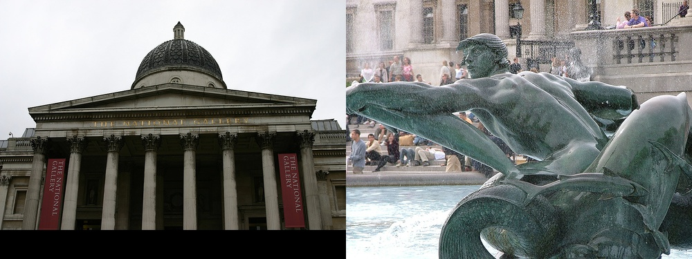
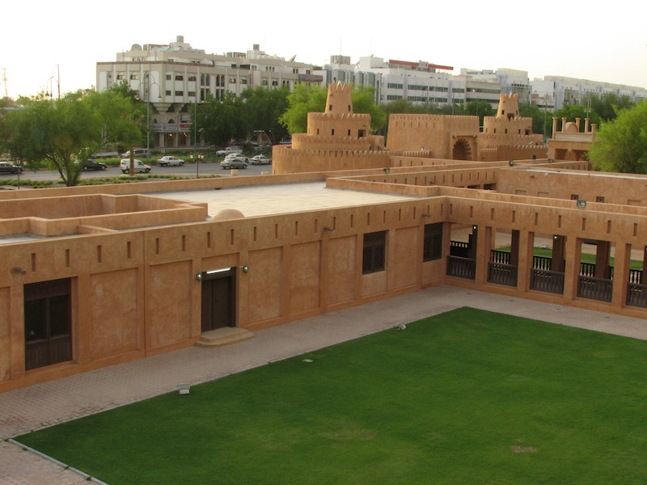

# Warping, Matching, Stitching, Blending

### Note: Codes and input images should be in the same folder while running the commands as mentioned in the Assignment-2 documents.

### Part 1: Image matching and clustering

Matching two images:
- Extracted ORB feature keypoints of an image using OpenCV implementation
- Hamming distance is used to match the descriptors
- While matching keypoints of 2 images, 0.8 threshold is set for the first closest and the second closest match points
- To speedup the process of matching, strong keypoints are selected from an image, using the response attribute of a keypoint.
- A keypoint is considered strong, if the response of a keypoint is more than the mean of responses of all keypoints
- Match function returns count of matching keypoints, chamfer distance, and corresponding keypoints from both the images

Image Clustering:
- Similarity matrix is constructed for images to be clustered
- This similarity matrix can have either count of match points between distances or chamfer distance. A Boolean parameter needs to be passed to this similarity_mat function if we need count of match points or chamfer distance
- To reduce the computation time, only upper diagonal similarity matrix is calculated and copied to the remaining part
- K-means clustering is implemented on the eigen vectors of similarity matrix

Evaluating Clustering:  
For N images in dataset
- True Positives (TP): the number of pairs where our clustering correctly assigned them to the correct cluster
- True Negatives (TN): the number of pairs where our clustering correctly assigned them to different clusters
- Pairwise Clustering Accuracy (Accuracy):
)
- Below is the pairwise clustering accuracy for different iterations and similarity metrics on 93 images given in part1-images folder and 10 clusters

- Chamfer distance is giving better accuracy although it takes time. Reason for taking almost double time is that it runs match function twice for a pair of images to maintain the symmetric nature. Whereas, match count only runs one time for a pair of images
- In the default code, we have 500 iterations and Chamfer distance as a similarity metric
- Match count runs faster but has relatively low accuracy
- We can have chamfer distance as similarity metric and quickly run the clustering by using only top few eigen vectors. Here we are compromising on time and giving importance to pairwise clustering accuracy

Observations:

1. Successful cases:

| | | |
|:-------------------------:|:-------------------------:|:-------------------------:|
| Fig 1: Clear background and same hue |  Fig 2: Invariant to minor occlusions|
|  Fig 3: Invariant to color changes, scaling and viewpoint |  Fig 4: Invariant to illumination and inside or outside|

2. Failed cases and their probable reasons:

| | | |
|:-------------------------:|:-------------------------:|:-------------------------:|
| Fig 5: Completely different view points from inside and outside |  Fig 6: Different hue could be the reason for not able to match keypoints well|
|  Fig 7: Object not present to match|  Fig 8: Objects not in scene disturb matching|

Notes to run part1 of code:
- At the end of the command output filename with .txt format should be mentioned. If this is missed, last image will get corrupted
- All the images in the command should path relative to where the code is being run. For example, if the code is being run outside part1-images folder the each image should be entered as part1-images/eiffel-18.jpg and so on.
- By default, clustering is run on Chamfer distance as similarity metric. If clustering needs to be run on count of match points, use_count_flag should be set to True in similarity_mat function in the main method. 
- For the 93 images given in part1-images folder, 200-500 iterations takes about 28 minutes

### Part 2: Image transformations

#### Step-1: Warping image using given transformation matrix:
-	Applies a given 3x3 transformation matrix to produce a corresponding warped image. 
-	It uses inverse warping with bilinear interpolation to estimate pixel values in warped image.
-	Inverse matrix is used to find coordinates in original image that corresponds to a point in warped image and uses “near_by_pixels” function to identify surrounding pixels and bilinear_interpolation function to calculate pixel values.
-	If corresponding coordinates of warped image in the original image are out of bounds, then their pixel values are assigned as 0 (black).

Results on lincoln.jpg image using given transformation:

| | | |
|:-------------------------:|:-------------------------:|:-------------------------:|
| Original image |  Transformed image|

#### Step-2: Calculating transformation matrix using feature correspondences across 2 images and warping image1 to look like image 2.
-	“tranformation_matrix” function takes in ID for type of transformation and feature correspondences to compute transformation matrix
-	Computing transformation matrix involves solving linear system of equations. Translation, Euclidian, affine and projective transformations involve 2, 4, 6 and 8 equations respectively.
-	Numpy solve function used for solving equations does not work for singular matrix.

| | | |
|:-------------------------:|:-------------------------:|:-------------------------:|
| Input image |  Desired orientation|   Output image|

### Part 3: Automatic image matching and transformations
Design, specifications and assumptions: 
-	The matching key points are obtained using the match function between two images.
-	RANSAC algorithm is applied on matching key points to select the best hypothesis i.e transformation matrix with maximum inliers support.
- Parameters to RANSAC algorithm:
  - N : Number of iterations 
  - Inlier threshold: Euclidian distance threshold for a point to be considered as a match. We have set it to 3
  - Ratio: Inlier ratio for a hypothesis to be valid.  used Ratio =0.8
  - n: number of random points required to calculate transformation matrix. We have used n=4
- Calculation of N (Number of iterations):
 
  - S = number of samples = 4
  - p = confidence of answer( probability) =0.99
  - e = outliers ratio in matches = assumed to be 0.8 to be on safer side
  - we got N= 2875
-	Matching key points between images should be greater than 4 for the RANSAC algorithm to work.
-	Four corresponding points are randomly sampled and used to find the hypothesis in each iteration. hypothesis_votes function is used to calculate support for the hypothesis and model with highest support is stored.
-	Further, if best hypothesis inlier ratio lass that Inlier ratio threshold, then threshold is reduced by 0.05 and above steps are repeated till conditions are satisfied. 
-	Transformation matrix obtained using the RANSAC algorithm is then utilized to Warp & Stitch the images to create a panorama. 
-	Panorama function:
  - Method to decide panorama image size:
    - Obtained the min and max values of x and y among transformed coordinates of image2  and original of image1
    -	New width and height are calculated based on min and max values
    -	Transformation matrix is adjusted to the new image size system. 
  - A blank image is created using dimensions obtained from above steps and then first image is populated in the left part of panorama image. 
  - The second image is then filled into the canvas using inverse warping and bilinear interpolation using the inverse of the transformation matrix 
  - For overlapping locations, assigning only image1 pixel values gave better results than taking average. 
  
## Panorama Results:

### Case-1:

| | | |
|:-------------------------:|:-------------------------:|:-------------------------:|
| Input 1 |  Input 2|

 Panorama
  
### Case-2:

| | | |
|:-------------------------:|:-------------------------:|:-------------------------:|
| Input 1 |  Input 2|

 Panorama

### Case-3:

| | | |
|:-------------------------:|:-------------------------:|:-------------------------:|
| Input 1 |  Input 2|

 Panorama

### Case-4:

| | | |
|:-------------------------:|:-------------------------:|:-------------------------:|
| Input 1 |  Input 2|

 
Panorama

### Case-5:

| | | |
|:-------------------------:|:-------------------------:|:-------------------------:|
| Input 1 |  Input 2|

 Panorama

All the images are aligning correctly but need to implement smoothening techniques to get better panorama images. 
